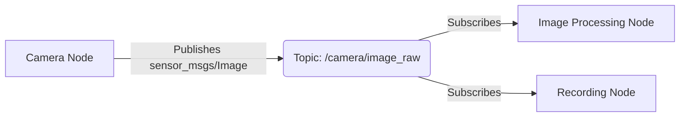
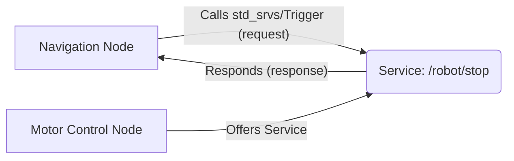

In the previous chapter, we introduced ROS 2 as the robotic nervous system. Now, let's dive into its fundamental building blocks: Nodes, Topics, and Services. Understanding these concepts is crucial for developing any ROS 2 application.

## 1. Nodes: The Brain Cells of Your Robot

Imagine your robot's software as a collection of independent, specialized "brain cells" that work together. In ROS 2, these brain cells are called **Nodes**. Each Node is an executable process that performs a specific task.

**Examples of Nodes:**
*   A camera driver Node that captures images.
*   A motor control Node that sends commands to wheels.
*   A navigation Node that plans paths.
*   A sensor fusion Node that combines data from multiple sensors.

Nodes are designed to be modular and reusable. You can start, stop, or debug them independently without affecting the entire system.

## 2. Topics: The Sensory Nerves and Motor Commands

Nodes need to communicate with each other. This is where **Topics** come in. Topics are named buses over which Nodes send and receive data asynchronously. Think of them as streams of information.

*   **Publishers:** Nodes that send data to a Topic are called **Publishers**. They "publish" messages onto the Topic.
*   **Subscribers:** Nodes that receive data from a Topic are called **Subscribers**. They "subscribe" to the Topic to get messages.

A single Topic can have multiple Publishers and multiple Subscribers. The type of data sent over a Topic is defined by its **Message Type**. For example, a camera Node might publish `sensor_msgs/Image` messages on a `/camera/image_raw` Topic.

**Simple Diagram of Topics:**

This asynchronous, one-way communication is ideal for continuous data streams like sensor readings, odometry, or status updates.

## 3. Services: The Reflex Arcs

Sometimes, a Node needs to request a specific action from another Node and wait for a response. This synchronous request-response communication is handled by **Services**. Think of Services as functions that Nodes can call on each other.

*   **Service Servers:** Nodes that offer a Service are called **Service Servers**. They wait for requests and send back responses.
*   **Service Clients:** Nodes that request a Service are called **Service Clients**. They send a request and block until they receive a response.

Similar to Topics, Services have a **Service Type** that defines the structure of the request and response messages. For example, a robot might offer a `std_srvs/Trigger` service on `/robot/stop` to stop all movement, which returns a success/failure boolean.

**Simple Diagram of Services:**

Services are best suited for actions that are not continuous, such as triggering an event, querying a specific piece of information, or performing a single computation.

## Summary

*   **Nodes:** Independent executable programs (brain cells).
*   **Topics:** Asynchronous, one-way data streams (sensory nerves/motor commands).
*   **Services:** Synchronous, request-response communication (reflex arcs).

These three concepts form the backbone of ROS 2's communication system, enabling complex robotic behaviors through modular and distributed software components. In the next chapter, we'll see how to implement these concepts using Python and `rclpy`.